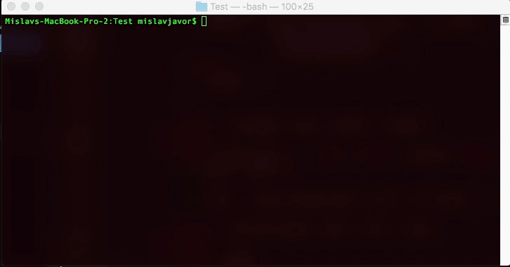

# `mktree`

A simple tool for quick creation of file structures made in Swift

# Usage

# Commands

- `dir` - `\dir <directory-name> <file1> <file2> ... <fileN>`

Creates a new directory with the name `<directory-name>` and creates files inside that directory named `<file1>...<fileN>`
Files list is optional

---

- `file` - `\file <file-name> <file-content>`

Creates a new file with the name `<file-name>` and content `<file-content>`

---

- `up`

Sets parent directory as a *current* directory for making files and directories

---

- `end`

Exits the program

---

# Author

Mislav Javor

mislav.javor@outlook.com
